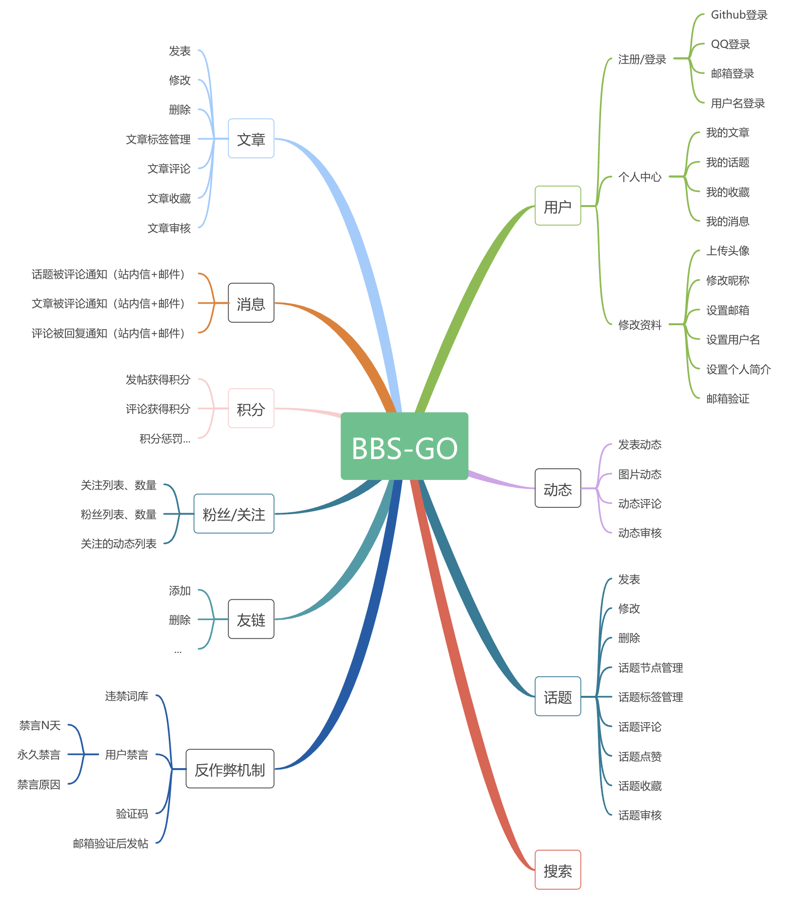

> 感谢您的支持与鼓励！如果您喜欢这个开源项目，不妨给它点个⭐️⭐️⭐️，您的星星是我们前进的动力 🙏🙏🙏

## 介绍

本项目是基于`bbs-go` （一个基于 Go 语言开发的开源社区论坛系统）开发的讨论区，可以用于研发等组织内部话题的讨论和分享。关于bbs-go的详细情况，请参照：
- Github: [https://github.com/mlogclub/bbs-go](https://github.com/mlogclub/bbs-go)
- Gitee: [https://gitee.com/mlogclub/bbs-go](https://gitee.com/mlogclub/bbs-go)

本项目的源代码存放地址是：
https://github.com/szscottchen/npibbs
本项目遵从原bbs-go的GPL3.0协议进行开源。

本项目在bbs-go基础上，侧重于一个企业内部研发部门的讨论和交流而做了增强。相比bbs-go，增加的内容主要有：

- 图片和文章等附件部署在应用服务器所在的机器，这样更照顾内部研发部门的信息安全考量。
- 后台管理中增加批量导入方式建立用户的功能，导入模版基于一般企业的组织形式设计。
- 增加了一种新的发帖类型“呼叫支援”，也即呼救。这样发表话题的人可以呼唤更多人对一个关键话题或设想进行讨论，题主可以对认为有帮助有价值的跟帖进行加分，增加相关回帖用户的积分。
- 增加了企业微信端的访问话题和跟进话题的功能，这样用户可以在企业微信端使用论坛。
- 每个话题里增加了AI总结功能，可以对话题进行总结，提取讨论的闪光点，帮助找出观点和创意。

## 系统结构和技术栈

本项目基于 **bbs-go** ，采用典型的前后端分离架构。

bbs-go/
├── server/          # 后端服务 (Go)
├── site/            # 前端站点 (Nuxt.js + Vue 3)
├── admin/           # 管理后台 (Vue 3 + Arco Design)

### server

> 基于`Golang`搭建，提供接口数据支撑。

技术栈

- iris ([https://github.com/kataras/iris](https://github.com/kataras/iris)) Go语言 mvc 框架
- gorm ([http://gorm.io](http://gorm.io)) 最好用的Go语言数据库orm框架
- resty ([https://github.com/go-resty/resty](https://github.com/go-resty/resty)) Go语言好用的 http-client
- cron ([https://github.com/robfig/cron](https://github.com/robfig/cron)) 定时任务框架
- goquery ([https://github.com/PuerkitoBio/goquery](https://github.com/PuerkitoBio/goquery)) html dom 元素解析

### site

> 前端页面渲染服务，基于`nuxt.js`搭建。

技术栈

- vue.js ([https://vuejs.org](https://vuejs.org)) 渐进式 JavaScript 框架
- nuxt.js ([https://nuxtjs.org](https://nuxtjs.org)) 基于Vue的服务端渲染框架，效率高到爆

### admin

> 管理后台系统，基于`vue.js + element-ui`搭建。

技术栈

- vue.js ([https://vuejs.org](https://vuejs.org)) 渐进式 JavaScript 框架
- element-ui ([https://element.eleme.cn](https://element.eleme.cn)) 饿了么开源的基于 vue.js 的前端库

## 功能介绍

- **话题管理** - 发帖、回帖、节点分类
- **文章管理** - 文章发布
- **评论系统** - 评论功能
- **AI 总结**  - 话题智能总结
- **企业微信** - 企业微信集成
- **搜索功能** - 全文搜索
- **用户中心** - 个人设置、用户列表、批量导入
- **话题管理** - 话题审核、节点管理
- **文章管理** - 文章审核、标签管理
- **系统设置** - 菜单、角色、API 管理

## 安装和部署

## 联系方式

## Contributors

